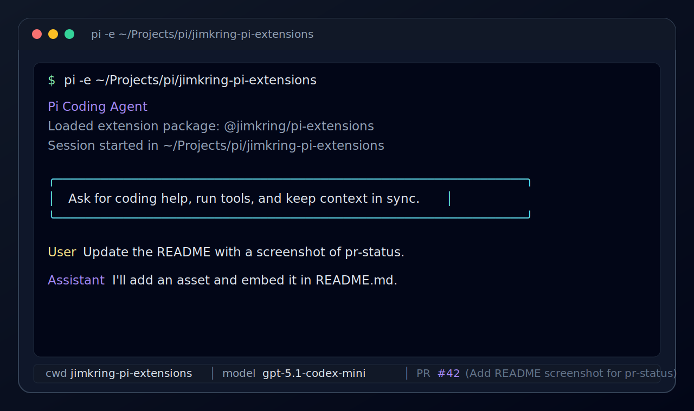

# Jim Kring Pi Extensions

Pi extension packages for Jim Kring's coding workflow.

This repository is organized as a small monorepo: each extension lives in its own package under `packages/`, while the repository root remains a bundle package that installs all extensions together.

## Packages

### `@jimkring/pi-pr-status`

Shows the current GitHub PR number and title in the Pi footer.



Package directory: [`packages/pr-status`](packages/pr-status)

### `@jimkring/pi-session-name`

Exposes session naming as an LLM-callable tool.

Package directory: [`packages/session-name`](packages/session-name)

## Install

### Install all extensions from GitHub

The root package still installs all extensions:

```bash
pi install git:github.com/jimkring/pi-extensions
```

### Install individual packages from npm

After the workspace packages are published, install them individually:

```bash
pi install npm:@jimkring/pi-pr-status
pi install npm:@jimkring/pi-session-name
```

### Local development

Run one package at a time:

```bash
pi -e ./packages/pr-status
pi -e ./packages/session-name
```

Or run the root bundle locally:

```bash
pi -e .
```

### Select one extension from the GitHub bundle

Pi does not currently treat `git:github.com/jimkring/pi-extensions/pr-status` as a subdirectory install. That URL is parsed as a separate Git repository.

To load only one extension from the GitHub bundle before npm publishing, use package filtering in Pi settings:

```json
{
  "packages": [
    {
      "source": "git:github.com/jimkring/pi-extensions",
      "extensions": ["packages/pr-status/index.ts"],
      "skills": [],
      "prompts": [],
      "themes": []
    }
  ]
}
```

## Development

```bash
npm install
npm run check
npm run pack:dry-run
```

## License

MIT
