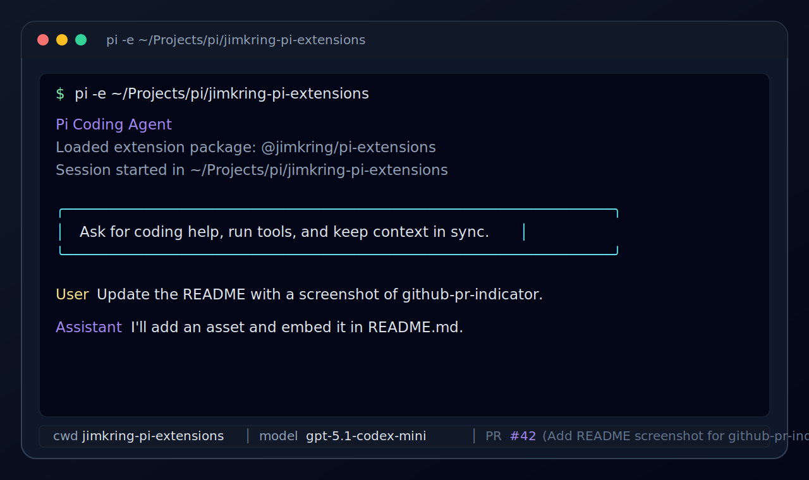

# `@jimkring/pi-github-pr-indicator`

Pi extension that shows the current GitHub pull request in the Pi footer.



## Install

After publication:

```bash
pi install npm:@jimkring/pi-github-pr-indicator
```

For local development from this repository:

```bash
pi -e ./packages/github-pr-indicator
```

The repository root can also be installed as a bundle that includes this extension:

```bash
pi install git:github.com/jimkring/pi-extensions
```

## Requirements

- GitHub-backed Git repository checkout, such as a repository with a GitHub remote
- GitHub CLI: `gh`
- Authenticated GitHub CLI session via `gh auth login`
- Current branch must have an open GitHub PR for a footer indicator to appear

## Behavior

- Runs read-only `git` and `gh pr view` commands.
- Does not write files or modify the repository.
- Shows `PR #1234 (title)` in the Pi footer when a PR is found.
- Clears the footer indicator when no PR is found.
- Registers the `github_pr_indicator_update` tool so the agent can refresh the footer after creating a PR or switching branches.

## License

MIT
